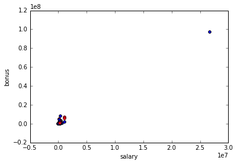
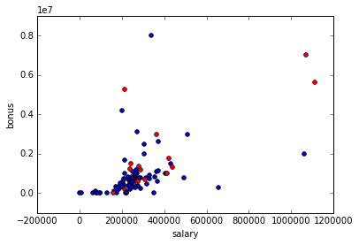
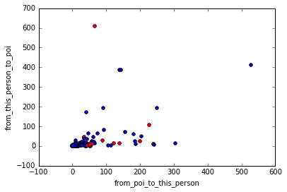
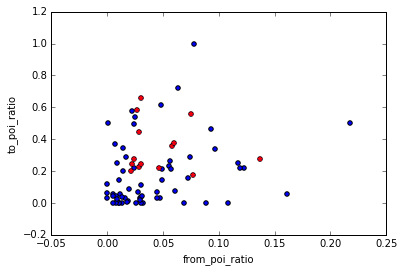

# Udacity: Intro to Machine Learning - Final Project

### Introduction 

In this project we'll use Machine Learning to identify persons of interest (POIs) in the Enron case of the early 2000s.

Enron was one of the largest companies in the United States. By 2002, it had collapsed into bankruptcy due to widespread corporate fraud. In the resulting Federal investigation, there was a significant amount of typically confidential information entered into public record, including tens of thousands of emails and detailed financial data for top executives.

The sheer size of the data set makes it very cumbersome for humans to analyze, however given that the data is available in a digital format it lends itself well to be analyzed using Machine Learning techniques. This report documents the machine learning techniques used in building a POI identifier.

There are four major steps in my project:

1. Understanding the Dataset and Questions
2. Feature Engineering and Selection
3. Algorithm Selection
4. Tuning & Evaluation
5. Cross-Validation


```python
import math
%matplotlib inline 
import matplotlib.pyplot as plt

import sys
import pickle
sys.path.append("../tools/")

from feature_format import featureFormat, targetFeatureSplit
from tester import dump_classifier_and_data

### Load the dictionary containing the dataset
with open("final_project_dataset.pkl", "r") as data_file:
    data_dict = pickle.load(data_file)
```

### 1 Understanding the Dataset and Questions

#### 1.1 Initial investigation


```python
## total number of data points
print "total number of data points:", len(data_dict)


## allocation across classes (POI/non-POI)
print "Allocation across classes:"
poi_count = 0
non_poi_count = 0
for name in data_dict:
    if data_dict[name]['poi'] == True:
        poi_count += 1
    else:
        non_poi_count += 1
print "    POI:", poi_count
print "    Not POI:", non_poi_count


## number of features
sample_features = data_dict[data_dict.keys()[0]]
print "Data is available for the following", len(sample_features), "features:"
for feature in sample_features:
        print "    -", feature


## are there features with many missing values?
print "Missing values for each feature:"
nan_dict = {}
for feature in sample_features:
    count = 0
    for name in data_dict:
        try:
            if math.isnan(float(data_dict[name][feature])):
                count += 1
        except:
            pass
    nan_dict[feature] = count
print nan_dict
```

    total number of data points: 146
    Allocation across classes:
        POI: 18
        Not POI: 128
    Data is available for the following 21 features:
        - salary
        - to_messages
        - deferral_payments
        - total_payments
        - exercised_stock_options
        - bonus
        - restricted_stock
        - shared_receipt_with_poi
        - restricted_stock_deferred
        - total_stock_value
        - expenses
        - loan_advances
        - from_messages
        - other
        - from_this_person_to_poi
        - poi
        - director_fees
        - deferred_income
        - long_term_incentive
        - email_address
        - from_poi_to_this_person
    Missing values for each feature:
    {'salary': 51, 'to_messages': 60, 'deferral_payments': 107, 'total_payments': 21, 'loan_advances': 142, 'bonus': 64, 'email_address': 35, 'restricted_stock_deferred': 128, 'total_stock_value': 20, 'shared_receipt_with_poi': 60, 'long_term_incentive': 80, 'exercised_stock_options': 44, 'from_messages': 60, 'other': 53, 'from_poi_to_this_person': 60, 'from_this_person_to_poi': 60, 'poi': 0, 'deferred_income': 97, 'expenses': 51, 'restricted_stock': 36, 'director_fees': 129}


#### 1.2 Outlier Removal


```python
features = ["poi", "salary", "bonus"]
data = featureFormat(data_dict, features)

dot_plot(data, features)
```





```python
print outliers('salary', 1)
```

    [('TOTAL', 26704229)]


The 'TOTAL' entry seems to sum up all the individual data points:


```python
total = 0
for name in data_dict:
    try:
        total += data_dict[name]['salary']
    except:
        pass
print total
```

    53408458


Since we're only interested in the actual observations, the best course of action is to remove it.


```python
## Remove and plot again
data_dict.pop('TOTAL')
data = featureFormat(data_dict, features)

dot_plot(data, features)
```





There's a cluster of points and then a number of points seem to fan out from that cluster. Let's investigate those in more detail:


```python
print outliers('salary', 3)
print outliers('bonus', 3)
```

    [('SKILLING JEFFREY K', 1111258), ('LAY KENNETH L', 1072321), ('FREVERT MARK A', 1060932)]
    [('LAVORATO JOHN J', 8000000), ('LAY KENNETH L', 7000000), ('SKILLING JEFFREY K', 5600000)]


These datapoints pertain to people high up in the organisation, so it sounds plausible that they had significantly higher salaries / bonuses. Several of them are POIs, so we will leave the data unchanged as it seems a good indicator

### 2 Feature Engineering and Selection

#### 2.1 Feature Creation

Fraud at the scale of Enron requires collusion amongst a network of people. It's reasonable to assume that the structure of a network is reflected in the amount of emails members of the network send each other. Let's investigate the features 'from_poi_to_this_person' and 'from_this_person_to_poi'.


```python
features = ['poi', 'from_poi_to_this_person', 'from_this_person_to_poi']
data = featureFormat(data_dict, features)

dot_plot(data, features)
```





```python
print outliers('from_poi_to_this_person', 4)
print outliers('from_this_person_to_poi', 4)
```

    [('LAVORATO JOHN J', 528), ('DIETRICH JANET R', 305), ('KITCHEN LOUISE', 251), ('FREVERT MARK A', 242)]
    [('DELAINEY DAVID W', 609), ('LAVORATO JOHN J', 411), ('KEAN STEVEN J', 387), ('BECK SALLY W', 386)]


We would have expected a high correlation between incoming and outgoing email to/from POIs, however this correlation seems weak. I.e., David Delainey seems to have a lot of email from POIs, but relatively little sent. Similarly, several people sent 200+ emails to POIs, but received very few back. As a result, the POI observations in red look mixed in with the non-POI observations. 

Perhaps this is due to the fact that some people generally send a lot more email than others. So let's create a new feature that gives us the ratio of incoming/outgoing emails to/from POIs.


```python
# create new dataset 'my_dataset' as per poi_id.py file instructions
my_dataset = data_dict
for name in data_dict:
    try:
        my_dataset[name]['from_poi_ratio'] = float(data_dict[name]['from_poi_to_this_person']) / data_dict[name]['to_messages']
    except:
        my_dataset[name]['from_poi_ratio'] = 0
    try:
        my_dataset[name]['to_poi_ratio'] = float(data_dict[name]['from_this_person_to_poi']) / data_dict[name]['from_messages']
    except:
        my_dataset[name]['to_poi_ratio'] = 0
```


```python
#print data_dict[data_dict.keys()[0]]
features = ["poi", "from_poi_ratio", "to_poi_ratio"]
data = featureFormat(my_dataset, features)

dot_plot(data, features)
```





This looks better; the correlation between the variables seems clearer and the POIs are closer together and easier to identify.

#### 2.2 Feature Selection

Given the skewed nature of the dataset (18 positives, 128 negatives) we will use a feature selection method based on reducing false detection, SelectFdr. We will start using all available features - including to_poi_ratio and from_poi_ratio and only keep the ones that are most useful.


```python
features_list = ["poi", "salary", "bonus", "to_poi_ratio", "from_poi_ratio",
            "deferral_payments", "total_payments", "loan_advances", "restricted_stock_deferred",
            "deferred_income", "total_stock_value", "expenses", "exercised_stock_options",
            "long_term_incentive", "shared_receipt_with_poi", "restricted_stock", "director_fees"]
data = featureFormat(my_dataset, features_list)
labels, features = targetFeatureSplit(data)


from sklearn.feature_selection import SelectFpr, SelectFdr, SelectFwe
from sklearn.feature_selection import chi2, f_classif
univariate_filter = SelectFdr(f_classif, alpha = 0.0001)
filtered_features = univariate_filter.fit(features, labels).transform(features)
feature_scores = univariate_filter.scores_
feature_pvalues = univariate_filter.pvalues_
feature_tf = univariate_filter.get_support(indices=False)
feature_indices = univariate_filter.get_support(indices=True)


from tabulate import tabulate
table = []
for i in range(1, len(features_list[1:])):
    row = []
    row.append(features_list[i])
    row.append(round(feature_scores[i-1], 2))
    row.append(round(feature_pvalues[i-1], 3))
    row.append(feature_tf[i-1])
    table.append(row)

table = sorted(table, key=lambda x: x[2])
print tabulate(table, headers = ["Feature", "Score", "P-Value", "Include"])
print ""
print "The SelectFpr algorhithm suggests using only the following features:"

# Start new features_list, seeding 'poi' as the dependent
reduced_features_list = ['poi']
for i in feature_indices:
    reduced_features_list.append(features_list[i+1])
print reduced_features_list
    
```

    Feature                      Score    P-Value    Include
    -------------------------  -------  ---------  ---------
    salary                       18.58      0              0
    bonus                        21.06      0              1
    to_poi_ratio                 16.64      0              0
    total_stock_value            24.47      0              1
    exercised_stock_options      25.1       0              1
    deferred_income              11.6       0.001          0
    long_term_incentive          10.07      0.002          0
    total_payments                8.87      0.003          0
    restricted_stock              9.35      0.003          0
    shared_receipt_with_poi       8.75      0.004          0
    loan_advances                 7.24      0.008          0
    expenses                      6.23      0.014          0
    from_poi_ratio                3.21      0.075          0
    deferral_payments             0.22      0.642          0
    restricted_stock_deferred     0.06      0.799          0
    
    The SelectFpr algorhithm suggests using only the following features:
    ['poi', 'bonus', 'total_stock_value', 'exercised_stock_options']


Using SelectFpr we select only features with a p-value < 0.001 for our analysis. Looking at the features we just created, 'to_poi_ratio' fulfilled that criterion and is one of the 5 features selected. The other feature created, 'from_poi_ratio' has a relatively low score (3.21) and a relatively high p-value (0.075), so it is not selected.

Overall, it's interesting to note that the 2 strongest features are stock related (exercised_stock_options and total_stock_value), followed by bonus (Score 21.06). We would expect POIs to have benefitted from the fraud they committed mainly through stock options and their bonuses.

#### 2.3 Feature Scaling

The features selected have vastly different scales, i.e. the financial features such as salary and bonus go into the millions, whereas the to_poi_ratio ranges between 0 and 1. This can be an issue in the sense that many classifiers look to minimize error rates, and naturally the error rate of a variable ranging in millions will be far bigger than the error rate of a variable ranging between 0 and 1. In order to avoid this relative oversensitivity to features with large scales, we will normalize all features to range between 0 and 1.


```python
from sklearn import preprocessing

data = featureFormat(my_dataset, reduced_features_list)
scaler = preprocessing.MinMaxScaler()
data_minmax = scaler.fit_transform(data)
```

### 3 Algorhithm Selection

We will run the scaled data against the algorhithms introduced in the course. Not all algorhithms require scaling, but in testing both scaled and unscaled I found that the algorhithms performed better or equal with scaled data.


```python
data = featureFormat(my_dataset, reduced_features_list)
#labels, features = targetFeatureSplit(data)
labels_scaled, features_scaled = targetFeatureSplit(data_minmax)

# Build train and test sets for validation
from sklearn import cross_validation
features_train, features_test, labels_train, labels_test = cross_validation.train_test_split(features_scaled, labels_scaled, 
                                                                                             test_size=0.3, 
                                                                                             random_state=42)
```

#### 3.1 Naive Bayes 


```python
from sklearn.naive_bayes import GaussianNB
clf = GaussianNB()
clf = clf.fit(features_train, labels_train)   
accuracy = clf.score(features_train, labels_train)
print "Accuracy Train:", accuracy

pred = clf.predict(features_test)
accuracy = clf.score(features_test, labels_test)
print "Accuracy Test:", accuracy
```

    Accuracy Train: 0.912087912088
    Accuracy Test: 0.8


#### 3.2 SVM 


```python
from sklearn.svm import SVC
clf = SVC()
clf = clf.fit(features_train, labels_train)
accuracy = clf.score(features_train, labels_train)
print "Accuracy Train:", accuracy

pred = clf.predict(features_test)
accuracy = clf.score(features_test, labels_test)
print "Accuracy Test:", accuracy
```

    Accuracy Train: 0.912087912088
    Accuracy Test: 0.75


#### 3.3 Decision Tree


```python
from sklearn import tree
clf = tree.DecisionTreeClassifier()
clf = clf.fit(features_train, labels_train)
accuracy = clf.score(features_train, labels_train)
print "Accuracy Train:", accuracy
print "Feature importance:", clf.feature_importances_

pred = clf.predict(features_test)
accuracy = clf.score(features_test, labels_test)
print "Accuracy Test:", accuracy
```

    Accuracy Train: 1.0
    Feature importance: [ 0.21787149  0.37625035  0.24520461  0.03426205  0.1264115 ]
    Accuracy Test: 0.775


#### 3.4 Random Forest


```python
from sklearn.ensemble import RandomForestClassifier
clf = RandomForestClassifier()
clf = clf.fit(features_train, labels_train)
accuracy = clf.score(features_train, labels_train)
print "Accuracy Train:", accuracy
print "Feature importance:", clf.feature_importances_

pred = clf.predict(features_test)
accuracy = clf.score(features_test, labels_test)
print "Accuracy Test:", accuracy
```

    Accuracy Train: 0.967032967033
    Feature importance: [ 0.14847824  0.30405978  0.15254894  0.23712117  0.15779187]
    Accuracy Test: 0.8


It's clear that the *SVM* algorhithm performed the worst. Looking at the ratios suggests that SVM took the "shortcut" to simply declare nobody a POI (train: 0.91 is equivalent to 82/91 non_POIs and 0.75 is equivalent to 30/40 for the test set). 

I was somewhat surprised by the fact that *Naive Bayes* outperformed the *decision tree algorhithm*, given that decision trees are supposed to be able to handle intercorrelation better and we saw earlier that some variables have correlation. It's clear that the Decision Tree overfitted, given that it's train accuracy is 1.0.

The *Random Forest* algorhithm matched the accuracy of Naive Bayes for the test set at 0.8, despite looking to be more overfit given it's higher train accuracy. I will therefore pick the Random Forest algorhithm for the final analysis, as I am more confident that with tuning and cross-validation it can further improve.

### 4 Tuning and Evaluation 

So far we only tested the default values of the random forest algorithm. However, Machine Learning Algorhithms typically come with a set of hyperparameters that we can use to tweak the algorhithm further and tune it to our dataset. The ultimate goal of such a tuning process is to optimize performance against an independent test set. In this section, we will specifically investigate the following main hyperparameters. These allow us to define more precisely how to run the Random Forest algorhithm:
1. class_weight - given the class-imbalance, we can tweak this parameter
2. min_samples_split - the minimum number of observation each tree leaf node should have
3. n_estimators - the number of trees to run The ultimate goal here is to make sure we don't overfit our algorhithm.

Optimizing for performance on an independent dataset implies that we need to prevent overfitting. Therefore, in assessing the performance we will only look at the test data set. Here, at a first glance, the accuracy we found with the algorhithms above looks quite high, ranging between 0.75 and 0.8. However, given the class-imbalance, namely that 75% of observations are not POIs, this number becomes less impressive. More specifically, due tot he imbalance it's easy to identify (or guess correctly) the non-POIs, whereas what we really set out to do is identifying POIs.

That's why we should focus more on the precision and recall scores: 


```python
eval_predictions(pred)
```

    True values     : [False, False, False, False, False, False, True, False, True, False, False, True, False, True, False, False, False, True, False, False, False, False, True, False, True, False, False, True, True, False, False, False, False, False, False, True, False, False, False, False]
    Predicted values: [False, False, False, False, False, False, False, False, False, False, False, False, False, False, False, False, False, False, False, False, False, False, False, False, False, False, False, False, False, False, False, False, False, False, False, True, False, False, False, False]
    Confusion Matrix:
    [[30  0]
     [ 9  1]]
    Precision: 1.0
    Recall: 0.1


Looking at it like this, we see that the Random Forest, is not performing really well yet at identifying the POIs. 
Our precision is perfect at 1.0, given that the one predicted POI is actually a POI. However, our model missed out on 9 out of 10 POIs, so there's lots more we should tweak.

Therefore, going forward we will measure against Precision and Recall rather than accuracy. We will test and identify good values for the hyperparameters and should be able to further improve our predictions by fine-tuning our algorhithm that way.

#### 4.1 class_weight

Given the class-imbalance, it looks like the parameter class_weight could help address it. Besides the default "None", we can pick between "balanced" and "balanced_subsample". In an initial run the performance actually decreased when using the latter, however this is really counter-intuitive. We will therefore set the default to "balanced" while tweaking the other parameters, then revisit class_weight once the other two parameters are tweaked.


```python
# Define base Random Forest Classifier
def randomForestclf(class_weight = "balanced", min_samples_split = 2, n_estimators = 10):
    from sklearn.ensemble import RandomForestClassifier
    clf = RandomForestClassifier(class_weight = class_weight, 
                                 min_samples_split = min_samples_split, 
                                 n_estimators = n_estimators)
    clf = clf.fit(features_train, labels_train)
    pred = clf.predict(features_test)
    precision, recall = eval(pred, print_or_return = "return") 
    return precision, recall
```

#### 4.2 min_samples_split


```python
# Simulate outcomes across values of min_samples_split
table = []
for i in range(1, 101, 10):
    intralist = []
    intralist.append(i)
    recall_list = []
    precision_list = []
    for r in range(1,100):
        precision, recall = randomForestclf(min_samples_split = i)
        precision_list.append(precision)
        recall_list.append(recall)
        r += 1
    avg_precision = sum(precision_list) / len(precision_list)
    avg_recall = sum(recall_list) / len(recall_list)
    
    intralist.append(avg_precision)
    intralist.append(avg_recall)
    intralist.append((avg_precision + avg_recall) / 2)

    table.append(intralist)
    i += 1

print tabulate(table, headers = ["min_samples_split","Precision","Recall", "AVG"])
```

      min_samples_split    Precision     Recall       AVG
    -------------------  -----------  ---------  --------
                      1    0.200337   0.0272727  0.113805
                     11    0.67773    0.243434   0.460582
                     21    0.629351   0.410101   0.519726
                     31    0.600301   0.528283   0.564292
                     41    0.581551   0.576768   0.579159
                     51    0.579441   0.511111   0.545276
                     61    0.36656    0.40101    0.383785
                     71    0.0656566  0.262626   0.164141
                     81    0.0555556  0.222222   0.138889
                     91    0.0808081  0.323232   0.20202


It's interesting to see that precision scores decrease for min_samples_split > 11, while for recall these scores keep increasing until min_samples_split is >41. In this exercise, we'll assume that identifying as many true POIs as possible (recall) is equally important as not accusing non-POIs of being POIs. Therefore we'll pick the highest average between the two scores, which is at min_samples_split = 41.

#### 4.3 n_estimators


```python
# Simulate outcomes across values of n_estimators
table = []
for i in [1, 10, 25, 50, 100, 250]:
    intralist = []
    intralist.append(i)
    recall_list = []
    precision_list = []
    for r in range(1,100):
        precision, recall = randomForestclf(min_samples_split = 41, n_estimators = i)
        precision_list.append(precision)
        recall_list.append(recall)
        r += 1
    avg_precision = sum(precision_list) / len(precision_list)
    avg_recall = sum(recall_list) / len(recall_list)
    
    intralist.append(avg_precision)
    intralist.append(avg_recall)
    intralist.append((avg_precision + avg_recall) / 2)

    table.append(intralist)
    i += 1

print tabulate(table, headers = ["n_estimators","Precision","Recall", "AVG"])
```

      n_estimators    Precision    Recall       AVG
    --------------  -----------  --------  --------
                 1     0.190542  0.505051  0.347796
                10     0.265496  0.549495  0.407496
                25     0.299846  0.561616  0.430731
                50     0.297613  0.579798  0.438706
               100     0.322279  0.593939  0.458109
               250     0.311889  0.6       0.455945


It looks like the highest performance is at n_estimators = 100.

#### 4.4 class_weight revisited

Let's now revisit the class_weight identifier and see which option gives the best outcome.


```python
# Simulate outcomes across values of min_samples_split
table = []
options = [None, "balanced", "balanced_subsample"]
for i in options:
    intralist = []
    intralist.append(i)
    recall_list = []
    precision_list = []
    for r in range(1,100):
        precision, recall = randomForestclf(class_weight = i, min_samples_split = 41, n_estimators = 100)
        precision_list.append(precision)
        recall_list.append(recall)
        r += 1
    avg_precision = sum(precision_list) / len(precision_list)
    avg_recall = sum(recall_list) / len(recall_list)
    
    intralist.append(avg_precision)
    intralist.append(avg_recall)
    intralist.append((avg_precision + avg_recall) / 2)

    table.append(intralist)

print tabulate(table, headers = ["class_weight","Precision","Recall", "AVG"])
```

    class_weight          Precision    Recall       AVG
    ------------------  -----------  --------  --------
                           0.722222   0.2      0.461111
    balanced               0.321116   0.59798  0.459548
    balanced_subsample     0.306735   0.59596  0.451347


It seems at the parameters of min_samples_split = 41 and using 100 estimators, we get the best result using the "balanced" class weight. Seeing now that the two balanced class-weights clearly outperform the non-adjusted algorhithm - particularly around Recall - also confirms our initial intuition.

### 5 Cross-Validation

It's important to evaluate algorhitms against a test set that they haven't been trained against. This prevents overfitting to available data. The results in section 3 however showed that there was still some overfitting. Part of that could be due to the relatively small sample size of just 91 in the training set. We can use cross-validation to run the Random Forest algorhithm multiple times against different subsets of the data set. This could further improve our classifier.


```python
from sklearn.cross_validation import cross_val_predict

clf = RandomForestClassifier(n_estimators = 100, min_samples_split = 41, class_weight = "balanced")
clf = clf.fit(features_train, labels_train)
pred = cross_validation.cross_val_predict(clf, features_scaled,
                                                labels_scaled, cv=3)
from sklearn.metrics import accuracy_score, confusion_matrix, precision_score, recall_score
print "Accuracy:", accuracy_score(labels_scaled, pred)
print "Confusion Matrix:"
print confusion_matrix(labels_scaled, pred)
print "Precision:", precision_score(labels_scaled, pred)
print "Recall:", recall_score(labels_scaled, pred)
```

    Accuracy: 0.801526717557
    Confusion Matrix:
    [[94 19]
     [ 7 11]]
    Precision: 0.366666666667
    Recall: 0.611111111111


Using cross-validation, we get a better recall rate than we had in the initial 40/60 split in section 4. Accuracy is about the same and precision is less. This score is probably more in line with what we can expect for predicting completely unknown data.

### Appendix: Helper Functions


```python
## Function for evaluating algorhithm predictions
def eval_predictions(pred, print_or_return = "print"):
    #convert true values to True/False and print
    true_list = []
    for i in labels_test:
        true_list.append(bool(i))
    
    #convert prediction values to True/False and print
    pred_list = []
    for i in pred:
        pred_list.append(bool(i))
    
    #calculate confusion matrix, precision & recall
    from sklearn.metrics import confusion_matrix, precision_score, recall_score
    precision = precision_score(true_list, pred_list)
    recall = recall_score(true_list, pred_list)
    
    #print or return
    if print_or_return == "print":
        print "True values     :", true_list
        print "Predicted values:", pred_list
        print "Confusion Matrix:"
        print confusion_matrix(true_list, pred_list)
        print "Precision:", precision
        print "Recall:", recall
    else:
        return precision, recall
```


```python
def dot_plot(data, features):
    for point in data:
        x_axis = point[1]
        y_axis = point[2]
        plt.scatter( x_axis, y_axis )
        if point[0] == 1:
            plt.scatter(x_axis, y_axis, color="r", marker="*")
    
    plt.xlabel(features[1])
    plt.ylabel(features[2])
    plt.show()
```


```python
def outliers(feature, n):
    from feature_format import featureFormat, targetFeatureSplit
    outliers = []
    for key in data_dict:
        val = data_dict[key][feature]
        if val == 'NaN':
            continue
        outliers.append((key,int(val)))
    
    max_outliers = sorted(outliers,key=lambda x:x[1],reverse=True)[:n]
    return max_outliers
```
